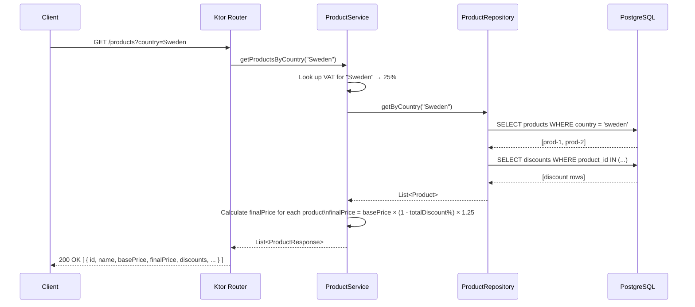
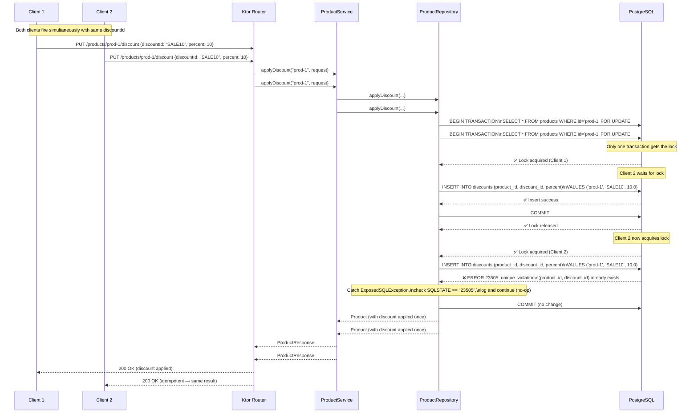

# Architecture

## Overview

The service is a single Kotlin/Ktor application backed by PostgreSQL. It exposes two HTTP endpoints for retrieving products and applying discounts. The application layer is deliberately thin — business logic lives in the service layer, persistence in the repository layer.

```
┌────────────────────┐
│   HTTP Client      │
└────────┬───────────┘
         │
┌────────▼───────────┐
│   Ktor Routes      │  (ProductRoutes.kt)
└────────┬───────────┘
         │
┌────────▼───────────┐
│  ProductService    │  (price calc, VAT lookup)
└────────┬───────────┘
         │
┌────────▼───────────┐
│ ProductRepository  │  (Exposed ORM, SQL)
└────────┬───────────┘
         │
┌────────▼───────────┐
│   PostgreSQL       │
└────────────────────┘
```

## Design Decisions

**Ktor + Exposed:** Lightweight and idiomatic for Kotlin. Exposed's DSL gives direct control over SQL, which matters for the concurrency strategy.

**HikariCP:** Production-grade connection pooling with sensible defaults (max 10 connections). Reduces connection overhead under load.

**Seed data on startup:** Products are seeded once at startup if the table is empty, so the API is usable immediately without manual setup.

**Separated concerns:** Model → Service → Repository pattern keeps each layer focused and testable.

---

## Concurrency Approach

The core challenge: prevent the same discount from being applied more than once to a product, even when many clients fire identical requests simultaneously.

### Strategy: Database-level unique constraint + SELECT FOR UPDATE

Two mechanisms work in tandem:

1. **Unique constraint** on `(product_id, discount_id)` in the `discounts` table. This is enforced by PostgreSQL at the storage engine level — no application-level check can be bypassed by concurrency.

2. **`SELECT FOR UPDATE`** on the product row before attempting the insert. This row-level lock ensures that concurrent transactions queue up rather than all racing to insert at once. Only one transaction holds the lock at a time; the rest wait, then find the unique constraint already satisfied and skip the insert gracefully.

### Why not application-level checks?

A naïve approach — "check if discount exists, then insert if not" — has a TOCTOU (Time-of-Check-Time-of-Use) race window. Between the check and the insert, another transaction can insert the same discount. The unique constraint eliminates this class of bug entirely.

### Idempotency

When an insert violates the unique constraint (PostgreSQL SQLSTATE `23505`), the exception is caught and the request continues normally, returning the current state of the product. The operation is safe to retry any number of times.

```
Outcome per concurrent request:
  - First to acquire lock → inserts discount → commits
  - All others → wait for lock → see existing row → skip insert → commit
  - All return 200 OK with the same product state
```

---

## Sequence Diagrams

### GET /products?country={country}



### PUT /products/{id}/discount



---

## Database Schema

```sql
CREATE TABLE products (
    id         VARCHAR(255) PRIMARY KEY,
    name       VARCHAR(500) NOT NULL,
    base_price DOUBLE PRECISION NOT NULL,
    country    VARCHAR(100) NOT NULL
);

CREATE TABLE discounts (
    id          SERIAL PRIMARY KEY,
    product_id  VARCHAR(255) NOT NULL REFERENCES products(id),
    discount_id VARCHAR(255) NOT NULL,
    percent     DOUBLE PRECISION NOT NULL,
    CONSTRAINT uq_product_discount UNIQUE (product_id, discount_id)
);
```

The `UNIQUE (product_id, discount_id)` constraint is the single source of truth for idempotency. No application-level guard can be bypassed by concurrency; this constraint is enforced atomically by the database engine.
